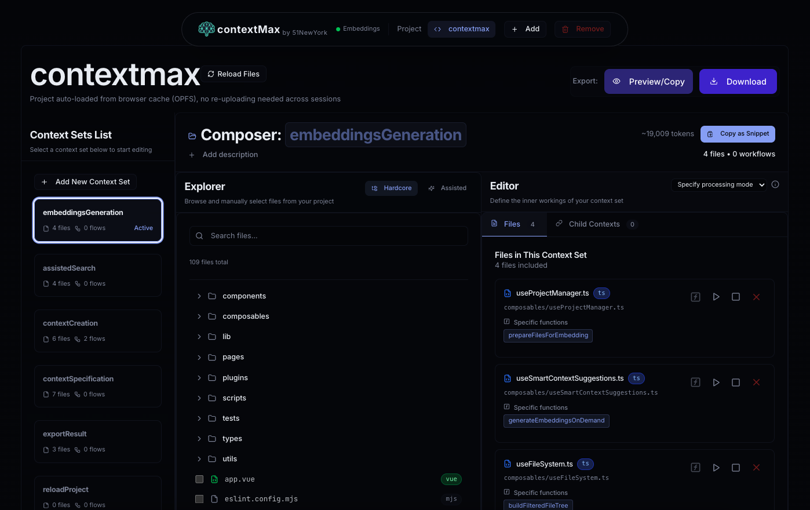
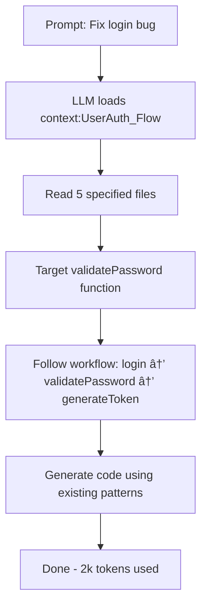

# ContextMax 

> Tell your LLM exactly what parts of your codebase matter for each task.

ContextMax is a browser-based tool that lets you create context sets for LLMs. Define which files, functions, and workflows are relevant for specific tasks. Get assistance from the embedded LLM to assist in your search. Your code never leaves your browser.

<!-- PLACEHOLDER: Demo video of creating context sets -->
**📹 [Watch: Creating Context Sets Demo](REPLACE_WITH_DEMO_VIDEO_URL)**

## 🚀 Quick Start

### [QUICKEST] Option 1: Use the hosted version

Go to the [curation tool](https://curator.contextmax.dev).

**Privacy Note**: Even on the hosted version, your code stays in your browser. No files are uploaded to our servers.

### Option 2: Run it locally using the npm package (Recommended)

```bash
npx contextmax
# by default it runs on port 3000, but you can also specify the port like this: 
PORT=3005 npx contextmax
```

This will automatically run the tool locally and open it on your browser.

### Option 3: Development setup

```bash
# Clone and install
git clone https://github.com/galliani/contextmax.git
cd contextmax
npm install

# Start development server
npm run dev
```

Open http://localhost:3000 in Chrome/Edge and start creating context sets!


## What is ContextMax

ContextMax helps you create context sets - JSON files that tell your LLM which parts of your codebase to focus on. Instead of dumping your entire project into an LLM, you specify:
- Which files are relevant
- Which specific functions matter
- How different parts connect (workflows)

Think of it as creating a map for your LLM to navigate your codebase.

<!-- PLACEHOLDER: Screenshot of the main interface -->


## Why ContextMax

LLMs often fail on real codebases because they:
- Generate code that ignores your existing patterns
- Miss critical dependencies and relationships
- Suggest solutions that don't fit your architecture
- Force you to repeatedly explain the same context

Even when LLMs succeed, they waste time and tokens searching through your entire codebase, reading irrelevant files to piece together context. With ContextMax, your LLM starts with the exact files and functions it needs, understands the workflow from entry point to completion, and produces accurate results faster with fewer tokens.

ContextMax solves this by letting you define context once and reuse it. Your team gets consistent, accurate AI assistance that actually understands your code structure.

### Without Context Sets


### With Manual File Lists


### With Context Sets



**📹 [Watch: LLM Performance with vs without Context Sets](https://youtu.be/8T8y31sKncY)**

## Key Features

- **Visual Builder**: Create context sets through a UI instead of editing JSON
- **100% Private**: Everything runs in your browser. No servers, no uploads
- **Function-Level Context**: Point to specific functions, not just files
- **Workflow Mapping**: Show how files and functions connect in your data flow
- **Version Control Ready**: Output is a simple JSON file you can commit
- **Team Sharing**: Everyone uses the same context definitions
- **Local AI**: Built-in embeddings model for smart file suggestions
- **Fast**: Uses IndexedDB caching and WebGPU when available


## How It Works

1. **Open your project folder** - Uses File System Access API (Chrome/Edge)
2. **Create context sets** - Name them based on features or workflows (e.g., "UserAuth_Flow")
3. **Add files and functions** - Pick whole files or specific functions
4. **Define workflows** - Show how code flows from entry point to completion
5. **Export context-sets.json** - Use with Cursor, Continue, or any LLM tool

<!-- PLACEHOLDER: Step-by-step screenshots -->
### Visual Walkthrough
| Step | Screenshot |
|------|------------|
| 1. Project Loading |  |
| 2. Context Creation |  |
| 3. Function Selection |  |
| 4. Workflow Definition |  |
| 5. Export JSON |  |


## The context-sets.json Format

ContextMax generates a single JSON file you can commit to your repo:

```json
{
  "schemaVersion": "1.0",
  "projectName": "MyProject",
  "filesIndex": {
    "file_abc12345": {
      "path": "src/auth/login.ts",
      "contexts": ["context:UserAuth_Flow"]
    }
  },
  "sets": {
    "context:UserAuth_Flow": {
      "description": "Complete user authentication flow",
      "files": [
        "file_abc12345",
        {
          "fileRef": "file_xyz67890",
          "comment": "User model with authentication methods",
          "functionRefs": [
            { "name": "validatePassword", "comment": "Validates user password" }
          ]
        }
      ],
      "workflows": [{
        "start": {
          "fileRef": "file_abc12345",
          "function": "login",
          "protocol": "http",
          "method": "POST"
        },
        "end": {
          "fileRef": "file_xyz67890",
          "function": "generateToken",
          "protocol": "function"
        }
      }],
      "uses": ["context:Database_Connection"],
      "systemBehavior": {
        "processing": {
          "mode": "synchronous"
        }
      }
    }
  }
}
```


## Tech Stack

- Nuxt.js 3 + Vue 3 + TypeScript
- Tailwind CSS v4, Reka UI, shadcn-nuxt
- @huggingface/transformers (WebGPU)
- Regex-based code parsing
- File System Access API, OPFS, IndexedDB
- Vitest

## Local AI Models

ContextMax runs AI models directly in your browser:

### Embeddings: `jinaai/jina-embeddings-v2-base-code` (~300MB)
- Semantic code search (finds code by meaning, not just text)
- Auto-classifies files (entry-point, core-logic, helper, config)
- Suggests related files and patterns
- Uses WebGPU for speed

Models download automatically on first use. For programmatic access:

```typescript
const { getModel } = useLLMLoader()
const embeddingsModel = await getModel('embeddings')
const embeddings = await embeddingsModel('your code snippet')
```

All processing happens locally. No external API calls.


## Development

### Requirements

- Node.js 18+
- Chrome/Edge (for File System Access API)

### Commands

```bash
# Development
npm run dev          # Start dev server on port 3000
npm run dev:clean    # Clean start (removes .nuxt cache)
npm run dev:fresh    # Fresh start (clean + reinstall)

# Building
npm run generate     # Build for production

# Testing
npm run test         # Run tests
npm run test:coverage # Run tests with coverage report
npm run coverage:badge # Generate coverage badge
```

### Browser Compatibility

ContextMax requires browsers that support:
- File System Access API (Chrome 86+, Edge 86+)
- WebGPU (for AI acceleration)
- IndexedDB and OPFS


## Contributing

We welcome contributions from anyone. Please report bugs via GitHub Issues with reproduction steps.


## License

Mozilla Public License 2.0 - see [LICENSE](LICENSE)

---

Made by [Galih](https://github.com/galliani) from [51 New York](https://51newyork.com)